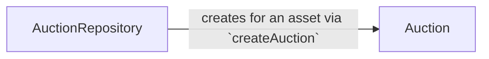
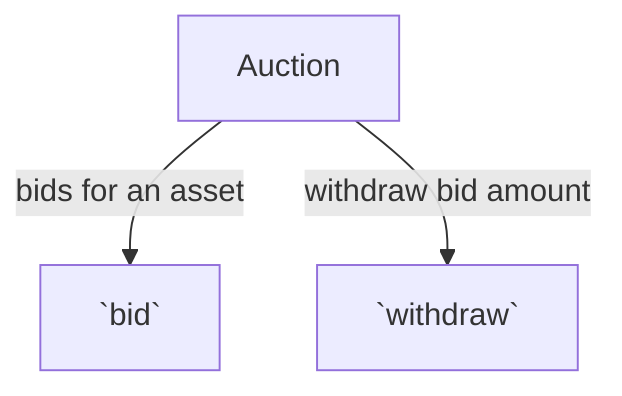

# Auction

## About

- **AuctionRepository** is the main contract that allows users to create auctions for asset like ERC20, ERC721, ERC1155, etc.
- **Auction** contract is a smart contract that allows users to:

  - bid for an asset, withdraw bid amount when expired (new bid is more than the highest bid) &
  - withdraw the bid amount when a higher bid is placed.

- Auction SC contains all the logic & storage for bidding, withdrawing bid amount, etc.
- The highest bidder automatically becomes the owner of the asset when the auction ends.
- **Feedback**

  - <u>Drawbacks</u>:
    - Every bidder can bid only once for the given Auction.
  - <u>Feature</u>:
    - A new bidder when bids for the asset, the previous bidder's bid is refunded. In this way, we won't need any `withdraw` function.
      - _Cons_: Additional gas cost for refunding the previous bidder to be paid by the new bidder.

- Architecture





```mermaid

```

## Installation

```console
yarn install
```

## Usage

### Build

```console
yarn compile
```

### Contract size

```console
yarn contract-size
```

### Test

```console
yarn test
```

### TypeChain

Compile the smart contracts and generate TypeChain artifacts:

```console
yarn typechain
```

### Lint Solidity

Lint the Solidity code:

```console
yarn lint:sol
```

### Lint TypeScript

Lint the TypeScript code:

```console
yarn lint:ts
```

### Coverage

Generate the code coverage report:

```console
yarn coverage
```

### Report Gas

See the gas usage per unit test and average gas per method call:

```console
REPORT_GAS=true yarn test
```

### Clean

Delete the smart contract artifacts, the coverage reports and the Hardhat cache:

```console
yarn clean
```

### Verify

```console
yarn verify <network_name> <deployed_contract_address> <constructor params>
// TODO: add your own SC arguments or empty
yarn verify <network_name> <deployed_contract_address> --constructor-args verify/auctionrepository.args.ts
```

For multiple arguments, follow this [guide](https://hardhat.org/plugins/nomiclabs-hardhat-etherscan.html#multiple-api-keys-and-alternative-block-explorers).

### Flatten

```console
yarn flatten <contract-filename-w-ext-with-dir> > ./flatten/<contract-filename-w-ext>
```

Then, the file can be used to upload the code manually (click on 'Contract' tab >> verify and publish) or using script (with Block explorer API as per the network)

### Deploy

- Environment variables: Create a `.env` file with its values in [.env.example](./.env.example)

#### localhost

```console
// on terminal-1
$ npx hardhat node

// on terminal-2
$ yarn hardhat deploy:Escrow --network localhost
```

#### ETH Testnet - Rinkeby

- Deploy the contracts

```console
yarn hardhat deploy:Escrow --network rinkeby
```

#### ETH Mainnet

- Deploy the contracts

```console
yarn hardhat deploy:Escrow --network mainnet
```
