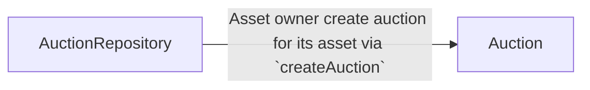
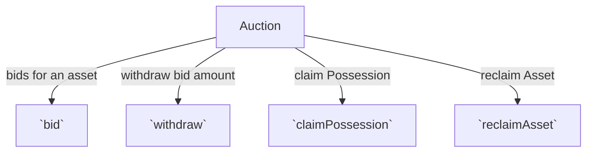
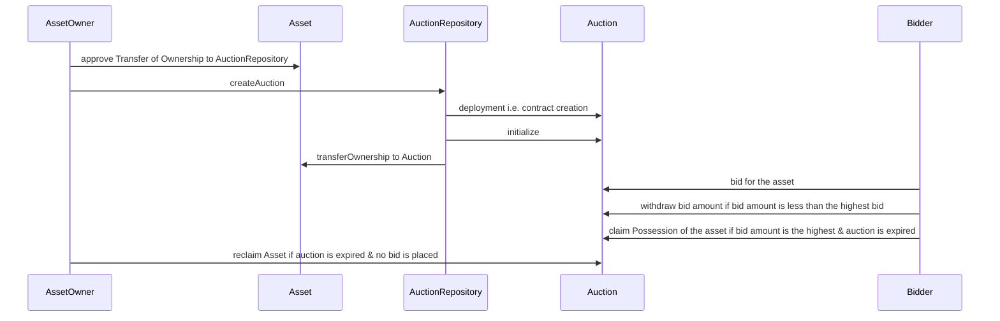

# Auction

## About

- **AuctionRepository** is the main contract that allows asset owners to create auction (1 per ERC20 asset) for asset standards like ERC20, ERC721, ERC1155, etc.
- **Auction** contract is a smart contract that allows users (assetOwner, bidder) to:

  - bid for an asset,
  - withdraw the bid amount when a higher bid is placed.
  - claim possession for the asset when the auction is over.
  - reclaim the asset when the auction is over and no one has bid for the asset.

- Auction SC contains all the logic & storage for bidding, withdrawing bid amount, etc.
- The highest bidder automatically becomes the owner of the asset when the auction ends.
- **Feedback**

  - <u>Drawbacks</u>:
    - Every bidder can bid only once for the given Auction.
    - Auction contract can't be paused directly as it's owned by the AuctionRepository contract, but not EOA. Hence, bugs (if remain) would be open for exploitation by hacker & no way to upgrade.
      > **Solution**: An workaround is to make the owner of AuctionRepository SC same for the Auction SC as well. In this way, the super owner can pause the Auction SC as well in case of bugs discovered in addition to AuctionRepository SC.
    - Factory clone pattern is used to create Auction contract for each asset, which is not gas efficient.
  - <u>Feature</u>:
    - A new bidder when bids for the asset, the previous bidder's bid is refunded. In this way, we won't need any `withdraw` function.
      - _Cons_: Additional gas cost for refunding the previous bidder to be paid by the new bidder.
    - Auction contract can be made as a facet of the AuctionRepository proxy contract, which will reduce the gas cost of creating a new auction contract.
    - Each auction would be given a unique `id` instead of contract `address` (generated by another contract using `create2` function which is a expensive operation).

- Architecture



---



---



## Installation

```console
yarn install
```

## Usage

### Build

```console
yarn compile
```

### Contract size

```console
yarn contract-size
```

### Test

```console
yarn test
```

### TypeChain

Compile the smart contracts and generate TypeChain artifacts:

```console
yarn typechain
```

### Lint Solidity

Lint the Solidity code:

```console
yarn lint:sol
```

### Lint TypeScript

Lint the TypeScript code:

```console
yarn lint:ts
```

### Coverage

Generate the code coverage report:

```console
yarn coverage
```

### Report Gas

See the gas usage per unit test and average gas per method call:

```console
REPORT_GAS=true yarn test
```

### Clean

Delete the smart contract artifacts, the coverage reports and the Hardhat cache:

```console
yarn clean
```

### Verify

```console
yarn verify <network_name> <deployed_contract_address> <constructor params>
// TODO: add your own SC arguments or empty
yarn verify <network_name> <deployed_contract_address> --constructor-args verify/auctionrepository.args.ts
```

For multiple arguments, follow this [guide](https://hardhat.org/plugins/nomiclabs-hardhat-etherscan.html#multiple-api-keys-and-alternative-block-explorers).

### Flatten

```console
yarn flatten <contract-filename-w-ext-with-dir> > ./flatten/<contract-filename-w-ext>
```

Then, the file can be used to upload the code manually (click on 'Contract' tab >> verify and publish) or using script (with Block explorer API as per the network)

### Deploy

- Environment variables: Create a `.env` file with its values in [.env.example](./.env.example)

#### localhost

```console
// on terminal-1
npx hardhat node

// on terminal-2
yarn deploy-local
```

#### ETH Testnet - Goerli

- Deploy the contracts

```console
yarn deploy-goerli
```

#### ETH Mainnet

- Deploy the contracts

```console
yarn deploy-eth
```
